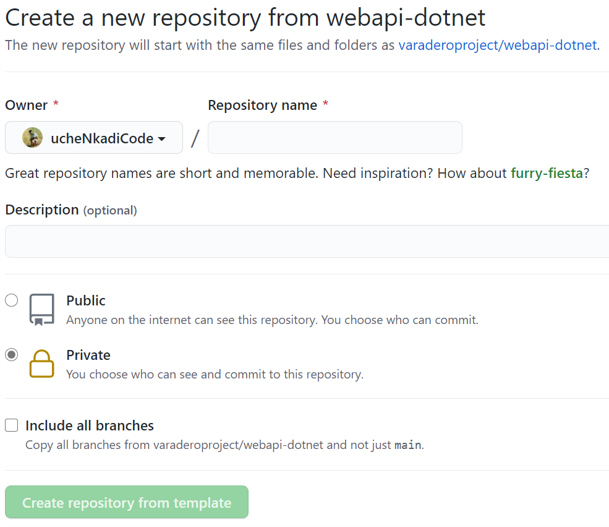
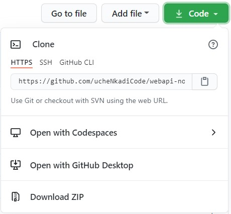
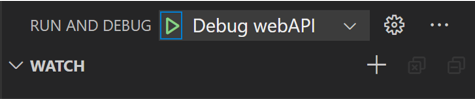
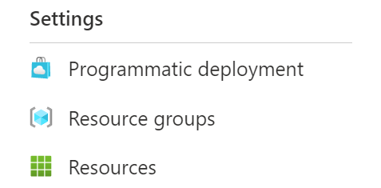
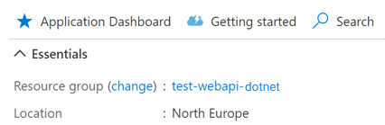

# Welcome to the Web API + SQL Accelerator (.NET)

Accelerators give you a practical starting point to help speed up your development cycle. Without writing any code, you will be able to run a fully developed application, deploy your app to Azure, and monitor its telemetry all with minimal configuration. We've taken care of everything with pre-configured development environments, pre-defined CI/CD pipelines and infrastructure as code definitions.

This accelerator implements a [.NET-based web API](src/webapi/), hosted as a web application, and backed by a Microsoft SQL database.

## Accelerator Quick Start

In this guide you will learn how to:

- Set up your repo and getting up and running in [GitHub Codespaces](https://code.visualstudio.com/docs/remote/codespaces).
- Connect the repo to Azure and deploy your application.
- View the live app's logs and metrics in the Azure Portal.

### Open your repo in Codespaces

Codespaces is a Github feature that enables you to run a full development environment in the cloud. It uses VS Code in the browser to host dev containers. The Accelerator comes complete with all the necessary installations and extensions for developing your application.

These steps will help you create your own repository and open it in Codespaces:

1. Click the green button "Use this template" to create a copy of this repository.
1. Select your GitHub account and enter a unique repository name.
1. Ensure this repo is **set to private** and click **Create repository from template**.

    

    > **Note:** Follow the remainder of the steps of `README.md` **in your own repo**.
1. Within **your own repo**, click on the green "Code" button and select **Open with Codespaces**.

    

    > **Note:** This feature is in private preview, so if you do not see the option, learn how to [run your app in a dev container](docs/tips-and-tricks.md#run-your-app-in-a-vs-code-development-container).

1. The repo will open inside of VS Code in your browser.

### Run the app

1. Once your Codespace is open, hit <kbd>F5</kbd> to start the application. This will run the `Debug webAPI` in the **Run and Debug** pane.

    

1. When VS Code prompts you, select **Open in Browser** in the lower right. This will take you to the Swagger page exposed by the Web API where you can test the different routes.

### Deploy the app

Accelerators set up your deployment process by implementing GitHub Workflows to deploy your application to Azure. More information on deployment can be found in the [Accelerator Components](docs/accelerator-components.md). Now that your app is running in a Codespace, let's get it hosted in Azure!

#### Connect your repository to Azure

GitHub workflows will use a Service Principal to authenticate to Azure and deploy the application to your subscription.

These steps will help you create a Service Principal and hook it up to your GitHub repo.

1. Activate your Azure Pass to create a new subscription.
1. Create a new terminal (`` Ctrl + Shift + ` ``) in your Codespace.
1. Log into your Azure account with `az login` and follow the prompts.
1. If you have multiple subscriptions, set the default with `az account set -s <subscriptionId>`
1. Enter `az ad sp create-for-rbac --role contributor --sdk-auth` to create a service principal.
1. Copy the full JSON output including `{}`.
1. Navigate to your repo's [GitHub Secret creation page](https://docs.github.com/en/actions/reference/encrypted-secrets#creating-encrypted-secrets-for-a-repository).
1. Add a new secret named `AZURE_CREDENTIALS` and paste the full JSON output.

#### Enable GitHub Container Registry

GitHub workflows will use the GitHub Container Registry to store the application deployment package.

These steps will help you authorize access for the GitHub Container Registry and use it during the deployment process.

1. [Enable the GitHub Container Registry](https://docs.github.com/en/packages/guides/enabling-improved-container-support#enabling-github-container-registry-for-your-personal-account) **for your personal account**.
1. [Create a personal access token](https://docs.github.com/en/github/authenticating-to-github/creating-a-personal-access-token#creating-a-token) with `write:packages` permission. This will allow your GitHub Workflow to publish Porter bundles.
1. Copy the personal access token.
1. Navigate to your repo's [GitHub Secret creation page](https://docs.github.com/en/actions/reference/encrypted-secrets#creating-encrypted-secrets-for-a-repository).
1. Add a new secret named `PACKAGE_ADMIN` and paste the token as the value.

#### Start the build workflow

The [build workflow](.github/workflows/build.yaml) creates a versioned deployment package (CNAB bundle) containing everything needed to get the applciation up and running. The build workflow, once successfully completed, will start the [deployment workflow](.github/workflows/deploy.yaml) and create the environments described in the [environments file](.github/environments/environments.yaml).

These steps will help you start the build workflow manually.

1. From GitHub on the browser, select the **Actions** tab in your repo.
1. Select the **Build** workflow.
1. Open the **Run workflow** dropdown and select **Run workflow**.
1. Upon completion, the build workflow will kick off the deploy workflow.

### View your live app

Once your app is successfully deployed, your Web API is running in an [App Service](https://azure.microsoft.com/en-us/services/app-service/) and now communicates with an instance of [Azure SQL Database](https://azure.microsoft.com/en-us/services/sql-database/). Your app is live!

These steps will help you open a running instance of your application in the cloud.

1. Once the deploy workflow is successfully completed, go to the [Azure Portal](https://portal.azure.com) and login.
1. Click the top-middle search bar and search for **Subscriptions** under the **Services** category.
1. Select the default subscription you chose during [Connect your repository to Azure](#connect-your-repository-to-azure).
1. On the left hand side navigation, scroll down and select **Resource groups**.

    

1. Select the resource group that contains `latest-test`. This should be the resource group created by the Accelerator deployment.
1. Select the App Service resource that begins with `app`.
1. In the **Essentials** section, click the URL to open your deployed application.

### Manage and monitor your app

With Accelerators, observability is automatic. We've set up an [Application Insights](https://docs.microsoft.com/en-us/azure/azure-monitor/app/app-insights-overview) resource with your deployment so you can monitor and view the logs of your app in real time.

These steps will help you view the health, logs, and metrics of your app.

1. From the [Azure Portal](https://portal.azure.com), navigate to your subscription and select the resource group that contains with `latest-test` (directions in the previous section).
1. Select the Application Insights resource that begins with `appi`.
1. From the **Overview** tab, observe the key diagnostics of your cloud application.
1. Click on **Application Dashboard** to get a comprehensive view of your app's performance and reliability.

    

## Next Steps

Great job, you did it! Now that your Accelerator is up and running, you may want to:

- [Modify the code base or run the app in another dev environment](docs/tips-and-tricks.md)
- [Learn more about the Accelerator architecture](docs/accelerator-components.md)

## Contact us

- Questions or thoughts on Accelerators? Chat with our devs on the [.NET Accelerator Discussion Forum](https://github.com/varaderoproject/dotnet-webapi-feedback/discussions)!
- Did you find a bug or think of an idea to improve Accelerators? [Submit an issue](https://github.com/varaderoproject/dotnet-webapi-feedback/issues) to our .NET repository. **We love your feedback!**
